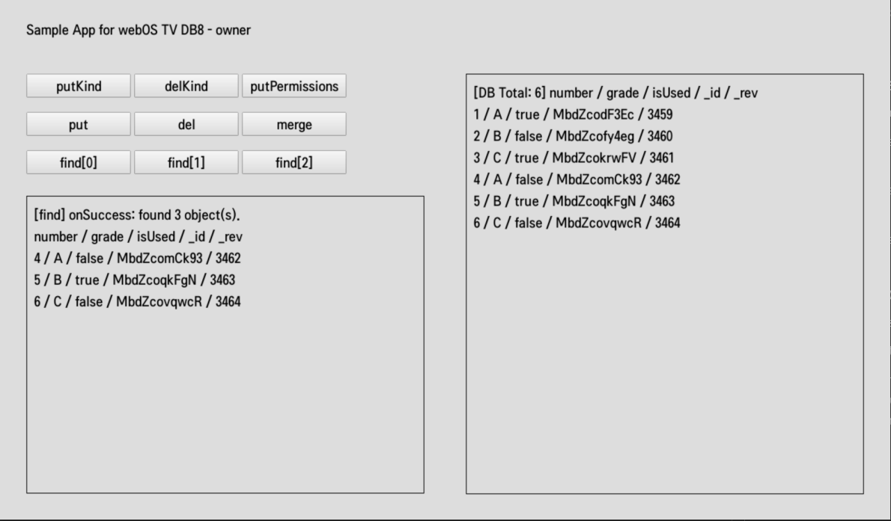
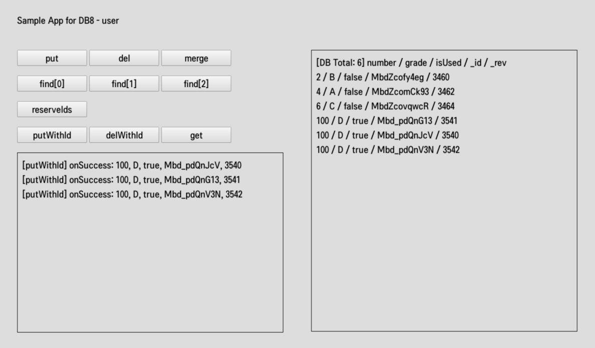

# DB8

DB8 is a storage method of webOS TV. DB8 is designed to meet the needs of robust, high-performance apps. DB8 is a service available on Luna Bus, and interfaces to an embedded JSON database. For more information about DB8, refer to DB8 Basics.

## Getting Started

To [put](https://webostv.developer.lge.com/develop/references/database#put)
, [delete](https://webostv.developer.lge.com/develop/references/database#del),
and [merge](https://webostv.developer.lge.com/develop/references/database#merge) data, create
a [kind](https://webostv.developer.lge.com/develop/references/database#kind)
using [putKind()](https://webostv.developer.lge.com/develop/references/database#putkind) method first.
The following code sample shows how to create a kind using the method.

- `private`: The private parameter is available on webOS TV 3.0 or later. If the private parameter is true, when
  an app is uninstalled, the kind is also removed.
- `schema`: The schema parameter is optional. If you define the schema, you must put the valid data that
  conforms to the schema format. For more information about the schema, refer to
  the [Schema Enforcement](https://webostv.developer.lge.com/develop/guides/db8-usage#schema-enforcement) page.

```javascript
webOS.service.request("luna://com.palm.db", {
  method: "putKind",
  parameters: {
    id: "com.sample.db.owner:1",
    owner: "com.sample.db.owner",
    private: true,
    schema: {
      id: "com.sample.db.owner:1",
      type: "object",
      properties: {
        _kind: {
          type: "string",
          value: kindId,
        },
        number: {
          type: "integer",
          description: "number",
        },
        grade: {
          type: "string",
          description: "grade string",
        },
        isUsed: {
          type: "boolean",
          description: "flag",
        },
      },
    },
    indexes: [
      {
        name: "index0",
        props: [{ name: "number" }],
      },
      {
        name: "index1",
        props: [{ name: "grade" }, { name: "isUsed" }],
      },
      {
        name: "index2",
        props: [{ name: "isUsed" }],
      },
    ],
  },
  onSuccess: function (res) {
    clearLog;
    printLog("[putKind] onSuccess");
  },
  onFailure: function (res) {
    printLog("[putKind] onFailure");
    printLog("(" + res.errorCode + ") " + res.errorText);
    return;
  },
});
```

## Finding Data with Queries

To find specific data from the database using queries, you must define indexes in
the [putKind()](https://webostv.developer.lge.com/develop/references/database#putkind) method. For more
information about queries and indexes, refer to
the [Queries and Indexing](https://webostv.developer.lge.com/develop/guides/db8-usage#queries-and-indexing) page.

Three indexes were defined in the kind that was created in the code sample above. The following query examples show how
to find data from the code sample.

```javascript
find([{ prop: "number", op: ">", val: 3 }]);
find([
  { prop: "grade", op: "=", val: "A" },
  { prop: "isUsed", op: "=", val: false },
]);
find([{ prop: "isUsed", op: "=", val: true }]);

function find(query) {
  webOS.service.request("luna://com.palm.db", {
    method: "find",
    parameters: {
      query: {
        from: "com.sample.db.owner:1",
        where: query,
      },
    },
    onSuccess: function (res) {
      var result = res.results;
      console.log("[find] onSuccess:", result);
      // do something with result
    },
    onFailure: function (res) {
      console.log(res.errorCode, res.errorText);
      // do something on failure
    },
  });
}
```

## Putting Permissions to Other Apps

To allow other apps' access to a kind,
use [putPermissions()](https://webostv.developer.lge.com/develop/references/media-database#putpermissions)
method. The following example shows how to grant permission to other apps.

```javascript
webOS.service.request("luna://com.palm.db", {
  method: "putPermissions",
  parameters: {
    permissions: [
      {
        operations: {
          read: "allow",
          create: "allow",
          update: "allow",
          delete: "allow",
        },
        object: "com.sample.db.owner:1",
        type: "db.kind",
        caller: "com.sample.db.*",
      },
    ],
  },
  onSuccess: function (res) {
    console.log("[putPermissions] onSuccess");
  },
  onFailure: function (res) {
    console.log("[putPermissions] onFailure:", res.errorCode, res.errorText);
  },
});
```

## Putting Data with Reserved IDs

After reserving data IDs
using [reserveIds()](https://webostv.developer.lge.com/develop/references/media-database#reserveids) method,
you can put, get, delete data by the IDs. The following example shows how to reserve IDs.

```javascript
function reserveIds(count) {
  webOS.service.request("luna://com.palm.db", {
    method: "reserveIds",
    parameters: {
      count: count,
    },
    onSuccess: function (res) {
      let result = res.ids;
      console.log("[reserveIds] onSuccess:", result);
      return result;
    },
    onFailure: function (res) {
      console.log("[reserveIds] onFailure:", res.errorCode, res.errorText);
      return [];
    },
  });
}
```

## Result in the webOS TV

You can install sample apps and see the results in the webOS TV or webOS TV Simulator as below image.




## Do's and Don'ts

- **Do** test these sample apps on your webOS TV or webOS TV Simulator.

- **Do** update the webOSTV.js library when the new version is released.

- The 'com.sample.db.user' sample app does not work properly if the 'com.sample.db.owner' sample app has not created a kind or granted the kind's permission.
